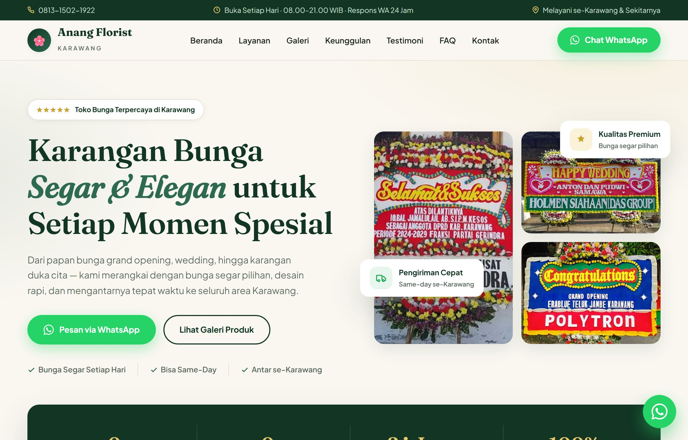
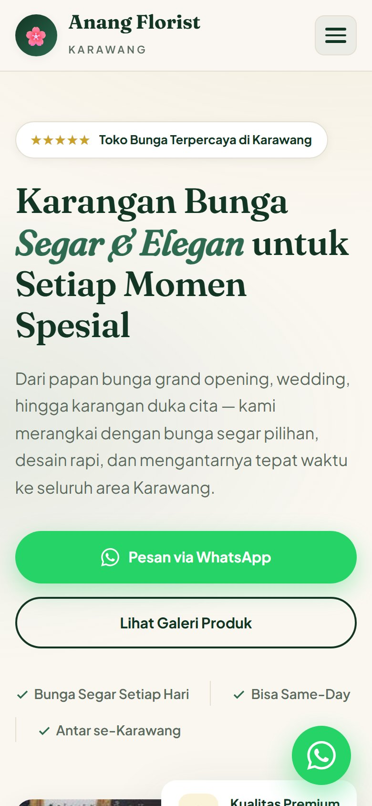

# 🌸 Anang Florist — Landing Page Profesional

Landing page modern dan berkonversi tinggi (*high-conversion*) untuk **Toko Karangan Bunga Karawang (Anang Florist)**. Dirancang dengan estetika floral premium, navigasi responsif, galeri interaktif dengan *swipe touch*, dan integrasi langsung ke WhatsApp 24 jam.

---

## 📸 Pratinjau Tampilan (Screenshots)

### 💻 Tampilan Desktop


### 📱 Tampilan Mobile
<p align="center">
  
</p>

---

## ✨ Fitur Utama

- **Estetika Mewah & Elegan**: Palet warna *Deep Forest Green* (`#123524`) dipadukan dengan aksen *Gold* (`#C9A227`) dan latar belakang *Warm Cream* (`#FAF7F1`).
- **Tipografi Modern**: Kombinasi font editorial **Fraunces** untuk heading dan **Plus Jakarta Sans** untuk kenyamanan membaca.
- **Responsif Penuh**: Tampilan optimal di semua ukuran layar (Desktop, Tablet, dan Ponsel).
- **Hero Section Dinamis**: Kolase foto produk interaktif dengan lencana kepercayaan (*badge review* & *floating cards*).
- **Statistik Animasi**: Penghitung otomatis saat di-scroll (*10+ Tahun*, *5.000+ Karangan Terkirim*).
- **8 Kartu Layanan Produk**: Meliputi Papan Bunga, Duka Cita, Standing Wedding, Hand Bouquet, Bunga Meja, Mobil Pengantin, Ronce Melati, dan Custom Design.
- **Galeri Filter Interaktif + Lightbox Pro**:
  - Filter kategori (*Semua, Papan Selamat, Duka Cita, Wedding, Bunga Meja*).
  - Pratinjau foto layar penuh dengan **Swipe Gesture** (geser layar dengan sentuhan jari di HP), indikator nomor foto, dan tombol instan *"Pesan Model Ini via WhatsApp"*.
- **Cara Pesan 4 Langkah Mudah**: Edukasi proses order yang jelas bagi calon pelanggan.
- **Testimoni Pelanggan & FAQ Accordion**: Tanya jawab interaktif dengan animasi buka-tutup halus dan dukungan aksesibilitas (*aria-expanded*).
- **Integrasi WhatsApp Siap Pakai**: Tombol CTA WhatsApp strategis, termasuk tombol WhatsApp melayang (*Floating Button*) beranimasi denyut (*pulse*).
- **Peta Lokasi Google Maps & Info Kontak Lengkap**: Alamat, jam operasional, jangkauan area pengiriman, dan rute navigasi.
- **Optimalisasi SEO & Standar Web**:
  - Meta description, Open Graph, meta tags lengkap.
  - JSON-LD Structured Data Schema (`Florist / LocalBusiness`).
  - *Lazy loading* gambar & performa cepat tanpa dependensi berat (*Vanilla HTML, CSS, JS*).

---

## 📁 Struktur File

```text
├── index.html                  # Halaman landing page lengkap (HTML + CSS + JS)
├── assets/                     # Aset foto produk asli & screenshot preview
│   ├── preview-desktop.jpg     # Screenshot tampilan desktop
│   ├── preview-mobile.jpg      # Screenshot tampilan mobile
│   └── toko-bunga-karawang-*   # Foto katalog karangan bunga
└── README.md                   # Dokumentasi proyek
```

---

## 🚀 Cara Menjalankan

Tidak memerlukan instalasi *build tool* (Node/Webpack) atau *framework* tambahan:
1. Unduh atau *clone* repository ini.
2. Klik ganda pada file `index.html` untuk langsung membukanya di browser web favorit Anda (Chrome, Edge, Safari, Firefox).

---

## 🛠️ Panduan Penyesuaian Data

| Bagian | Lokasi di `index.html` | Keterangan Penyesuaian |
|---|---|---|
| **Nomor WhatsApp** | Cari `081315021922` | Ganti dengan nomor WhatsApp pemilik toko |
| **Statistik Toko** | Class `.stats-inner` (atribut `data-count`) | Sesuaikan angka tahun pengalaman / jumlah pesanan |
| **Testimoni** | Section `#testimoni` | Perbarui ulasan atau nama pelanggan |
| **Jam & Alamat** | Section `#kontak` & `<footer>` | Perbarui jam operasional atau alamat fisik |
| **Peta Google Maps** | Tag `<iframe>` pada section `#kontak` | Ganti query link Google Maps jika lokasi berubah |
| **SEO & Domain** | Tag `<link rel="canonical">` & Open Graph | Sesuaikan dengan URL domain website Anda |

---

## 🌐 Panduan Publikasi (Deployment)

1. **cPanel / Hosting Tradisional**: Unggah file `index.html` dan folder `assets/` ke direktori `public_html/`.
2. **Platform Modern (Vercel / Netlify / GitHub Pages / Cloudflare Pages)**: Cukup hubungkan repository GitHub ini, maka website akan langsung tayang secara instan.
3. **WordPress**: Dapat diintegrasikan menggunakan plugin *File Manager* atau dijadikan subfolder/landing page mandiri.

---

© 2026 **Anang Florist Karawang**. Hak Cipta Dilindungi.
